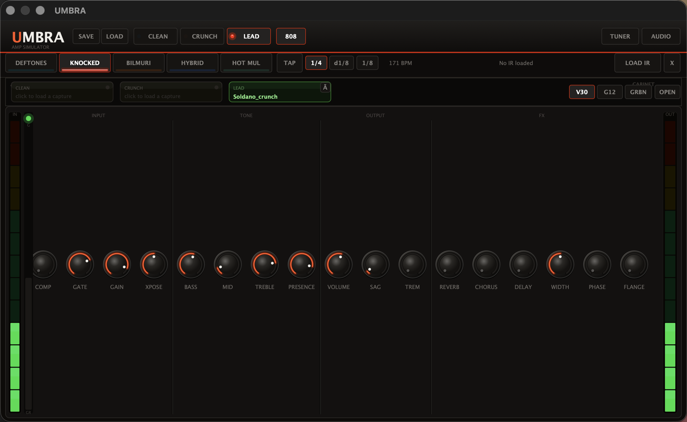

# UMBRA

A high‑gain guitar amp simulator built with [JUCE](https://juce.com) and
[RTNeural](https://github.com/jatinchowdhury18/RTNeural). UMBRA runs as a
standalone app **and** as a VST3 / AU plugin, and it loads real neural amp
captures (GuitarML / NeuralPi / Proteus `.json` models) alongside its own
hand‑built analog‑style amp engine.

> Built for modern metal and metalcore tones — tight low end, aggressive
> mids, and a proper noise gate — but it cleans up too.



---

## Features

**Amp engine**
- Three voiced channels — **Clean**, **Crunch**, **Lead** — each a multi‑stage
  waveshaper amp running inside an **8× oversampled** nonlinear path to keep
  high‑gain tones free of aliasing.
- **Neural amp captures.** Load any GuitarML‑format LSTM capture per channel
  (hidden sizes 8/16/20/24/32/40). When a capture is active it replaces the
  waveshaper stage and runs at the project sample rate; the analog power‑amp
  stage is bypassed (the capture already models it) and the noise gate switches
  to a high‑gain‑appropriate threshold.
- **808 / Tube Screamer** pre‑boost toggle for tightening the low end.
- Per‑channel **noise gate** with band‑passed sidechain detection, **optical
  compressor**, and Mesa‑style **power‑amp sag**.

**Cabinet & EQ**
- **Cabinet character** selector: V30, G12T‑75, Greenback, Open‑back — each a
  distinct 5‑filter voicing. Or load your own **impulse response** (`.wav`/`.aiff`).
- **4‑band parametric EQ** (low shelf, two peaks, high shelf) with a live
  **FFT spectrum analyzer** and draggable, double‑click‑to‑toggle band nodes.

**Effects**
- Dattorro **plate reverb**, **chorus**, **phaser**, **flanger**, stereo
  **mono‑delay** with **tap tempo** + note subdivisions, **tremolo**, and a
  mid/side **stereo width** control.

**Workflow**
- Genre **presets** (Deftones, Knocked Loose, Bilmuri, Linkin Park, Hot Mulligan),
  save/load your own, a built‑in **chromatic tuner**, input/output **metering**,
  and live gate/compressor **gain‑reduction indicators**.
- **±12 semitone** transpose (granular pitch shifter).

---

## Building

UMBRA uses CMake. JUCE 8 is expected as a sibling checkout in `./JUCE`
(it is `.gitignore`d, not vendored). RTNeural is fetched automatically by CMake
on first configure.

### Prerequisites
- CMake ≥ 3.22
- A C++17 compiler (Xcode / clang on macOS, MSVC on Windows, GCC/Clang on Linux)
- [JUCE 8.0.x](https://github.com/juce-framework/JUCE)
- Internet access on first configure (CMake pulls RTNeural via `FetchContent`)

### Steps

```bash
# 1. Clone this repo
git clone https://github.com/<you>/umbra.git
cd umbra

# 2. Get JUCE 8 next to the sources (matches CMakeLists.txt `add_subdirectory(JUCE)`)
git clone --branch 8.0.7 --depth 1 https://github.com/juce-framework/JUCE.git

# 3. Configure (Release) — this also fetches RTNeural
cmake -B build -G Ninja -DCMAKE_BUILD_TYPE=Release

# 4. Build everything (standalone + VST3 + AU)
cmake --build build
```

Artifacts land in:

| Format     | Path |
|------------|------|
| Standalone | `build/UMBRA_artefacts/Release/UMBRA.app` |
| VST3       | `build/UMBRA_Plugin_artefacts/Release/VST3/UMBRA.vst3` |
| AU         | `build/UMBRA_Plugin_artefacts/Release/AU/UMBRA.component` |

To build a single target: `cmake --build build --target UMBRA` (standalone) or
`UMBRA_Plugin_VST3` / `UMBRA_Plugin_AU`.

---

## Using neural amp captures

UMBRA loads GuitarML‑format LSTM models — the same `.json` files used by
[NeuralPi](https://github.com/GuitarML/NeuralPi),
[Proteus](https://github.com/GuitarML/Proteus), and
[SmartPedal](https://github.com/GuitarML/SmartGuitarPedal) (LSTM models only;
WaveNet `.json` files are not supported).

1. Put your `.json` captures in `~/Documents/UMBRA Models/`.
2. In the **AMP MODEL** row, click a channel slot (CLEAN / CRUNCH / LEAD).
3. Pick a capture — the slot turns green and that channel now runs the model.
4. The **GAIN** knob drives the model input like a guitar volume knob
   (±1 octave around unity). The tone stack, cab, EQ, and FX still apply on top.

Click the **✕** on a slot to revert that channel to the built‑in amp.

---

## Project layout

```
Source/
  Main.cpp                 standalone entry point
  MainComponent.*          standalone UI (LAF, knobs, EQ panel, neural slots)
  DSP/
    AmpProcessor.*         the amp engine (shared by standalone + plugin)
    NeuralAmpModel.h       RTNeural LSTM wrapper + GuitarML JSON loader
    DattorroReverb.h       Dattorro plate reverb
  UI/
    EqPanel.*              interactive 4-band EQ + FFT analyzer
    SharedComponents.*     UmbraLAF look-and-feel + level meters
  Plugin/
    PluginProcessor.*      AudioProcessor wrapper (VST3/AU)
    PluginEditor.*         plugin UI (mirrors the standalone)
CMakeLists.txt             standalone + plugin targets, RTNeural FetchContent
```

The DSP (`AmpProcessor`) and UI components are shared between the standalone and
plugin builds; only the host glue (`Main`/`MainComponent` vs
`PluginProcessor`/`PluginEditor`) differs.

---

## Acknowledgements

- [JUCE](https://juce.com) — audio/UI framework
- [RTNeural](https://github.com/jatinchowdhury18/RTNeural) — real‑time neural inference
- [GuitarML](https://github.com/GuitarML) — neural capture format and tone packs
